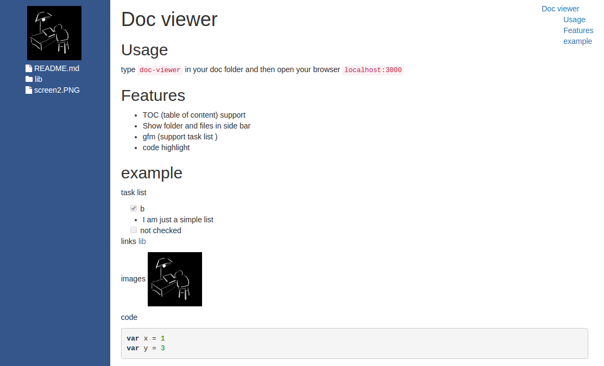

# doc-viewer

View markdown documentations locally in browser

## Usage

- `npm install -g doc-viewer`
- run `doc-viewer` in the folder where you have your doc, it will start a server.
- `localhost:3000/fileName.md` to view rendered markdown
- it also works like the simple http server in python.

You can update current version using `npm update -g doc-viewer`

## Features

- TOC (table of content) support
- Show folder and files in sidebar
- gfm (support task list ) -> use marked
- code highlight -> use highlightjs

Screen shot

## Develop

- npm install NOTE: you have to run as admin in windows in order to install node-sass
- `gulp dev` to start server and enable watch, the express server will reload when file change, but you have
to hit f5 to refresh the client.

## RoadMap

- [x] simple render
- [x] a global command line. `npm install -g doc-viewer`, then you can use it like python's simple server
- [x] make links in markdown work.
- [x] toc support
- [x] support task list #17
- [ ] allow combine options, toc, highlight etc.
- [ ] parse all markdown file and generate html and search.
