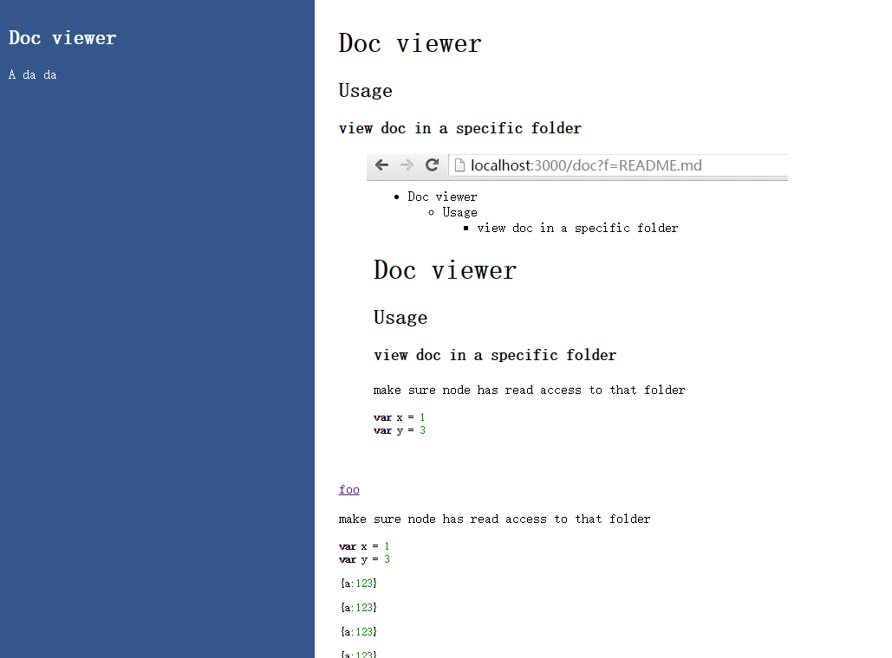

# Doc viewer

## Usage

type `doc-viewer` in your doc folder and then open your browser `localhost:3000`

### view doc in a specific folder

[foo](foo/README.md)


make sure node has read access to that folder

````javascript
var x = 1
var y = 3
````

````json
{a:123}
````

## Contribute

make a pr, and then ...